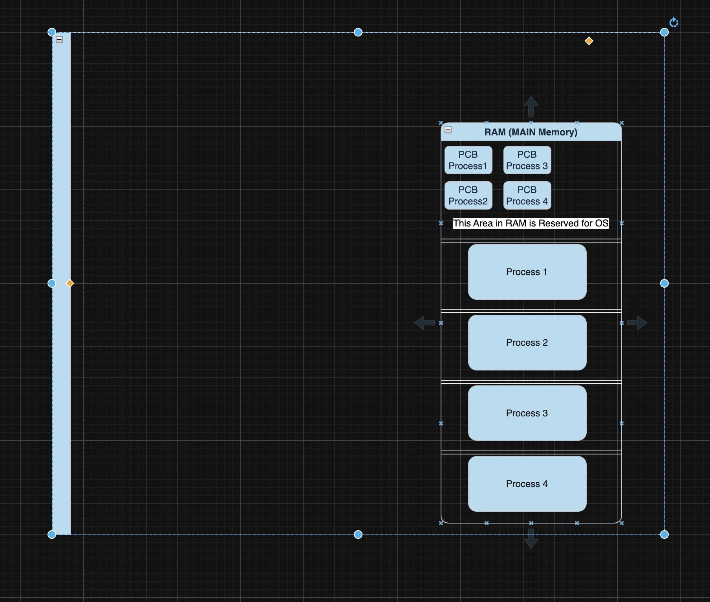
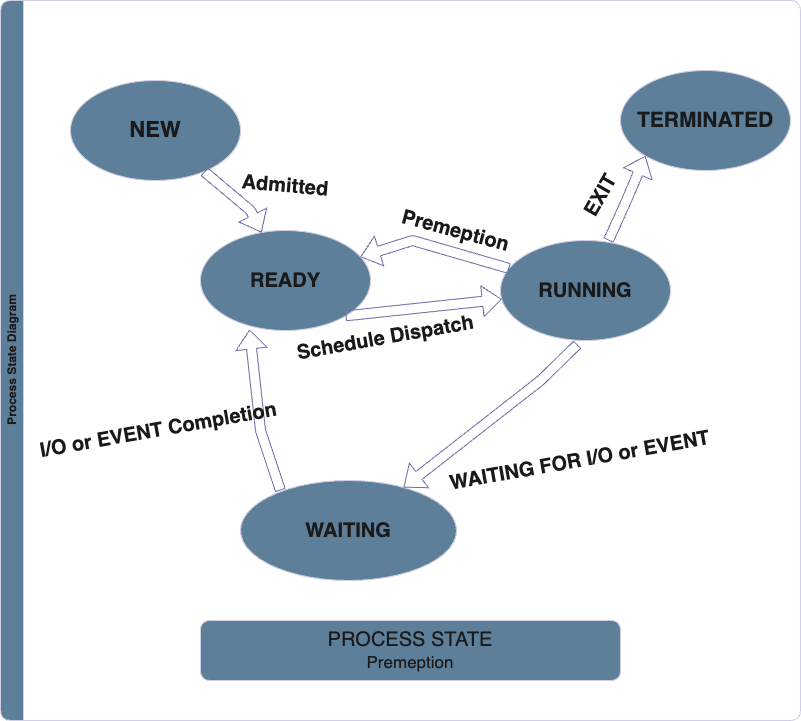
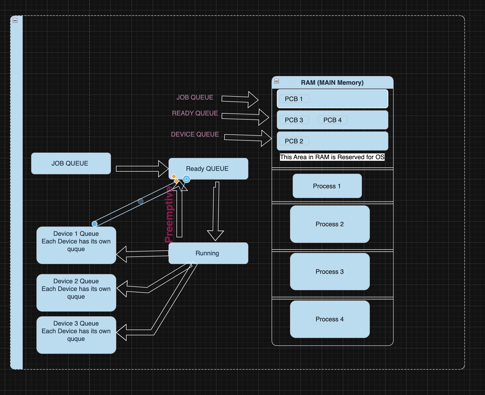
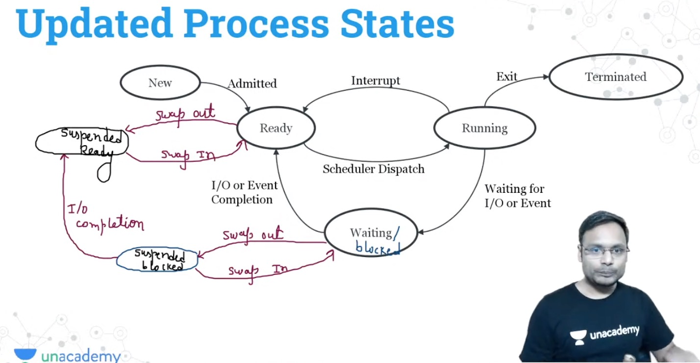

# **OPERATING SYSTEM**

Operating System is a system software / collection of program  which helps the user to interact with computer hardware.

Software abstracting hardware .
Interaction between user and hardware.
Set of utilities to simplify application execution.
Control Program.

Note: User cannot use computer hardware components directly  os acts as an intermediate between user and computer hardware.

Services of Operating System

**User Interface**  (It provides the Interface with provide connivence to user to use computer hardware)
**Program Execution** ( Most Important part of operating system) (It executes the instruction given by user into the cpu)
**I/O Operation** (Input Output Operations)
**File-System Manipulation** (File and Folder execution like create delete edit file and folder)
**Communication (Inter-Process  Communication)** (For example some document is written in MS word and  like to print in this OS handles gives command to printer or other output device to get executes communication between ms word to printer is inter-process communication).

**Error Detection**  (Error detection  like copying file ,folder etc  and that devices removed then OS do error detection like Source file is not available or removed)

**Resource Allocation** (Providing resources to process . Every process is loaded into RAM first to execute on CPU  like Multiple process are waiting to perform on HDD  HDD is slower than RAM which process executes first it depends on Operating System.

**Accounting**  Everything happening on computer system all accounting maintain by Operating system like which process using how much memory ,cpu utilisation it helps the application developer to improve application

**Protection & Security**   Operating System maintain that multiple process cannot interrupt with each other  etc etc...

## **GOALS of Operating System**

Connivence (User - Friendly)
Efficiency
Portability
Reliability
Scalability
Robustness

## **Parts of Operating System**

Kernel  - All features of Operating System like process executing , resource utilisation all operation perform by operating  system written in small functions.
All functions are collectively present in Kernel.

Shell - Shell is just an interface which helps the user to give commands to Operating System its of Graphical Type  (GUI) , Command line interface (CLI).

## **SYSTEM CALL**

System call is just a way for programs to interact with the operating system without system call no one cannot use functionalities of Operating System
User don't have privilege to access computer hardware operation

**DUAL MODE of Operation**
Dual mode is used to implement protection
2modes :
User Mode (mode bit = 1)
Kernel/System (mode bit = 0)

Let's understand  UserProcess  document want to save document in HDD

User cannot save document to HDD
User process calls System call  mode bit = 0 now kernel will save this document in HDD  once done change mode bit  =1   return to user.

**Types of Operating System**

Note : RAM  is the MAIN Memory  &  Some Part of RAM is reserved of OPERATING SYSTEM  and rest is for Running Program.
Process can do only one thing at one time either use CPU or I/O devices operation.

**Uni Programming OS**  - OS allows only one program to reside  in main memory apart from OS.
Process can do only one thing at one time either use CPU or I/O operation  if process need some I/O devices it has to leave CPU operation.  UNI Programming  is not good because single process cannot keep CPU and I/O devices busy simultaneously.

**Multi-Programming OS**  - Multi-programming OS allow multiple program to reside in main memory.
 If one process goes for I/O operation then another process use CPU utilisation.
Better CPU utilisation then uni-programming.
Degree of multiprogramming means  Number of running program(process) in main memory.
As the degree of multiprogramming increases CPU  utilisation also increases but upto a certain limit

**Types of Multi-Programming**
Preemptive
Non Preemptive

**NON-Preemptive**  A Process runs on CPU till its wish
					- Process leave CPU only when process terminates
					- Goes for I/O operation
**Preemptive** A process can be taken out forcefully taken out of CPU because there is another process which is waiting eagerly to run on CPU.

In Uni-programming A process cannot be taken out forcefully So its NonPreemptive because why forcefully process taken out there is only one process in main memory  there is no reason for that .

**Multi-Tasking OS** - Multi tasking OS  is an extension of multi-programming OS and also known as Time-Sharing OS  in which processes execute in round-robin fashion.

Round Robin
Executes each process for limited time duration then switch to another process.

CPU is too fast  it can run Media player , MS word , other application
These all are different process.

**Multi-User OS** -  Multi User OS means Multiple User are Connected through single  system Simultaneously.
Windows is not a Multi-User OS.
Linux & unix are multi user OS.

**Multi-Processing OS**  :  This OS is used in computer system with multiple CPUs.

Its of two Types :
 Tightly Coupled  : (Shared Memory)
 Loosely Coupled : (Distributed System)

Tightly Couples (Shared Memory) - In this System multiple CPUs are there  but  there is Single Main Memory (RAM) Shared with all CPU.

Loosely Coupled (Distributed System)- In this System multiple CPUs are there and each CPU has its own main memory.

**Embedded OS**  - In Embedded OS used interaction is minimum.
It designed for a specific purpose, to increase functionality and reliability for achieving specific task . ( System used in Washing Machine, AC,Fridge to make it Intelligent).

**Real Time OS**  - Real Time OS  (RTOS) are used in environment  where a large number of events, mostly external to the computer system, must be processed in short time within certain deadline.
Every process has a deadline
Types of Real Time OS
Hard RTOS   - Strict in deadline
Soft RTOS - Some relaxation in deadline

## Process

A program under execution is called process.

When a program became process

A program + runtime activity  = Process.

Program is just a code or some instruction
Runtime activity contain operand  & other information data

Process
Program Under execution
An instance of a program (A program is running)
Schedulable/Dispatch-able unit (CPU) (Cpu runs the process but OS send the process to the CPU).
Unit of execution (CPU)
Locus of control (OS)

Process as DATA Structure

Definition.  (Code or program (A Compiler will generate the code in binary) ).
Representation / Implementation (How process stored in memory)
Operations
Attributes

Representation of a Process

Note :
Each process will have such kind of reperensentation Different OS may have different position of this 4 section :
STACK , HEAP, DATA Section , Code and Text Section.
Code Section will store instruction
Data Section store public and static variable because public and static variable the score of those variable is lifetime availability till the process in execution one process terminated they are deleted.
Heap is a dynamic memory allocation
Stack contain local variables, function parameters and return address  are only created when any function calls happen
There is an Empty space in Process reperenstation stack and Heap Size are not fixed the usage will vary at runtime.

Operation on a Process

Create (Resource Allocation) - When a process is create resources are allocating like some memory if process need I/O device and files that resources can be  allocated.
Schedule, Run - process can be schedule and run
Wait/BLOCK - Process can be wait/block if process is waiting for certain event it can be blocked.
Suspend,Resume - Process can be suspensed due to certain reason or resuming the process
Terminate (Resource Deallocation) - Process can completed all the resources taken back

All this managed/operated  by Operating System.

Attributes of a Process
OS need attributes to control the process

PID - A unique id generated by OS  to uniquely identify the process
PC - Program Counter
GPR - General Purpose Register (When CPU executes the process store small information in Register)
List of Devices  - List of Devices
Type - What type of process either its System ,background, foreground process type
Size - The Size of the process in MB/KB
Memory Limits -  if process is stored  in Main Memory (RAM) from which Address to which address its stored in Occupied by process
Priority -  Whats the Priority
State -  Current State of Process.
List of Files - Example  media player is a process  now media player need some files to play  that access needed to play List of file contain all files which provide access to process.

All the Attributes of a Process is useful for User process and Is maintain by Operating System.

All those attributes are stored in PCB Process Control Block

Process Control Block

PCB also known as process descriptor

Let's Understand One Process P1 runs for sometime and P1 need to stop for somereason and P2 process runs , P2 Completes
Now there P1 will restart or resume.  P1 will resume not restart . If P1 will resume so we need P1 previous progress so that it resumes from where it stopped.

When P1 will Stopped at that time operating system Copy All registers value from CPU to PCB for that process.When process resumes PCB contain its prgress is also called Context

Context

The Content of PCB of a process are collectively known as Context

When CPU runs/stopped any process  the Conext of that process is loaded/unloaded into CPU  that is knows as Context Switching

Operating System do Context Switching // Context Switch is basically done by dispatcher. dispatcher is small program in OS basically responsible to context swtiching in Operating System.

Context Switch

Context Save  - Stopped a running process
Context Load  - Running another process

Note :-  Process itself Never access its and other process  PCB from Main Memory

Process can only access the area allocated to  that process in Main Memory
PCB stored in OS Area and Only OS can access it

Computing Means  - process is in Execution .

Process States

NEW State  - The Application is not running  is called New State . The program just kept in HDD.

READY STATE  -  The Application starts running  before application runs  the Operating System brings that process from New to Ready State .
Ready State means the process which are going to run / ready to run . Its not running may be there is some procees already running in CPU

Running STATE - when Process runs on CPU the state of that process is Running.
IF process is Completed  that exit and move to Terminated STATE .
IF process need Some I/O Operations  any input output operation that process move to WAITING /BLOCK STATE.

Once I/O Operation Completed  that process is moved to ready state  the OS dispact decides when that process move to running state.

The Process Moving from Running to Exit & Running to Waiting I/O Operation that only by process itself

Preemption Means When the running process forefully moved from Running to Ready that is preemption that is done by Operating System.

Now Admitted means when Program Moved New to Ready the Resource Allocation  Happening  (Process will get Main memory , Files access )

When Process Moved to Terminated All Resources are deallocation happens.

Note: Process itself move from Running to Itself or for I/O Operation that is block/waiting state
All other transisition apart from exit and I/O Operation will be done by Operating System

In NON - Preemption System

Process cannot move from Running to Ready by Operating System because in NON Prememption System forcefully process removal is not allowed process can only leave CPU
by its own wish  Either terminated or moved to I/O Operations

CPU vs IO Bound Process

IO bound  If the process is intensive in terms of IO operation
CPU Bound   If the process is intensive in terms of CPU operation

Question
will IO Bound Operation uses CPU ?

Answer  Yes Because any process wants IO operation that process first execute on CPU then only it transition for IO operations.

When the process terminated but the resources are not deallocated that process are called Zombie Process

Process Scheduling

Scheduling  is required because we can use the resources properly
Want to schedule the process to run on CPU so that CPU is utilization in better way resources are managed in better way
Operating System will do scheduling

Scheduling QUEUES

In main memory there is one OS reserved area  there are 3 queue

All Queue will contain PCB of processess.

Job Queue

Ready Queue

Device Queue

 

Job Queue  - all those  process which are in New State.
Ready Queue - all those process which are in Ready State.
Device Queue - all those  process which are waiting for a specific devices

Note In Devices Queue  each device has its own queue like if process waiting for Printer  that is in printer device queue if process waiting for HDD then move to HDD device queue

Types of  Schedulers

Long Term Scheduler (Job)

Short Term Scheduler (CPU)

Mid Term Scheduler (Medium Term)

When Process is Moving from New to Ready the Admitted Operation is done by Long-Term Scheduler.

Long Term Scheduler admitted the process by 2 ways

1. User wants to run the Application (It means user initiated the process)In this User admitted the process.
2. There are So many background process in Operating System which needs to executes in cpu  which runs in background these process are run by Operating System whever it wants.OS admitted the process that wil be decided by long term scheduler

Long Term Scheduler Brings the process from New to Ready State  In this Resource Allocation Happens.

Short term Scheduler

There are So Many process in ready state now Operating System decides which  one process runs on CPU that decision is taken by Short term scheduler.

It basically select one process to executes in CPU

Mid Term Scheduler

When there are more process are open and User trying to open one more application and there is no space is available in main memory

Then Mid term Scheduler  Swap Out the Inactive application which is inactive from longer . In that case mid-term scheduler swap out the application in Secondary Memory

When User back to that Inactive Application  that again Swap In into main memory.

In Secondary memory there is Some SWAP SPACE which is controller by OS. that the area used for swap In and Swap out

In This the process moved from waiting/blocked state to Suspended state that state is also called Suspended Blocked or from Ready State  That state is also called Suspended Ready

When Swapout happens from  Waiting /Blocked State Swap In also happen in waiting/blocked

When Swapout happens from  Ready  State Swap In also happen in Ready state

Nothing Change in PCB because PCB is in OS part in Main Memory  and It will remain there only

Sometime process is in  Suspended Blocked  and Completed IO Completed then can be moved to suspended ready

  

Note : -  Long term  Scheduler  Brings process from New to ready

Short term scheduler only select which process run on CPU  From Ready to Running  State transition  can be done by dispatcher brings the process from Ready to Running and Running To ready if Preemptive this transition can be done by dispactcher.

CPU Scheduling

Function : Make a selction  (One of the process selected from ready to run to CPU)

GOAL of Scheduling

Minimize Wait Time and turn around time
Maximize CPU utilization (Throughput)
Fairness (Fair Selection it select all types of process for running)

Long Term Scheduler Controls degree of multiprogramming It Increases the degree of multiprogramming

Mid term Controls degree of multiprogramming It Reduces the degree of multiprogramming

If process are in the New State do we have PCB also and where those PCB Stores
Yes, even when a process is in the New state, a Process Control Block (PCB) is created for it.
It's the state where a process is being created but has not yet been admitted to the ready queue by the operating system's long-term scheduler.
The PCB is stored in the operating system's memory, typically in a kernel data structure.

Most OSes maintain a process table in kernel space, where all PCBs are kept.

This is not in user memory but in protected memory accessible only to the OS.

Life of PCB:
New → PCB created

Ready/Running → PCB updated regularly

Terminated → PCB is eventually deleted (after cleanup)

***********************************-------------------------------------------------------------------------------------------------*****************************

Scheduling Times

Assume - there os no I/O

Arrival Times (AT) The time at which process arrives in the system or Admitted (Ready Queue).
Burst Time (BT) How Much time Process runs on CPU  Only time Spend on CPU
Completion Time (CT) When the process completes the execution.
TurnAround Time (TAT) The time spent from arrival to Completion  (CT - AT)

Waiting Time (WT)   the time process waits WT =  (TAT - BT)

Response Time (RT) whenever process arrives in system  from arrival to till first time get CPU that is called response time

Scheduling Length  : Max(CT) of among  all the process  whats the maximum time -  min(AT)

Throughput  - In perunit time how many process executed. Total No of process / Length.

CPU Scheduling Types

1 Preemptive
2 Non Preemptive

FCFS  (First Come First Serve)  The Process which comes  first based on  Arrival Time  that process is executes first of 2 process come at same time then  pick the process which is smaller ProcessId. processId is always unique. This is non preemptive - no one forcefull taken out the process.

In FCFS  - If there are 2 Process P1 and p2 p1 came first but it need more Burst time on CPU  and P2 came after p1  but p2 need just 2 sec on cpu
this is called Convoy Effect in FCFS  based on arrival time P1 schedules first  and result is If a large process is schedule first it shows down system performance

This is the drawback os First Come First Serve

SJF (Shortest Job First) Always remeber when process arrived Scheduling happens from that time Cannot wait for other process arrival (When the process arrive Have to Schedule it)
In SJF the process which has Smallest Burst Time that Schedule first
If 2 process arrived  the same Burst Time in that case process which arrive first that will schedule first If arrival time is also same then Smallest Process Id
Type is Non-Preemptive

In SJF  is preemption is not allowed. if new process arrived and less burst time cannot schedule that because SJF is non preemptive

SRTF (Shortest Remaining Time First)

Criteria is lesser burst time
Type is preemtive

In preemptive
If at time 0 one  process arrives having more burst time it  schedule for running  because  there is no other process so that process schedule for runnning

Then another process less burst time

Then Preempt the previous process schedule new process it works like that if 2 process same burst time then Arrival time will check

preemption can only happen when any new process arrives with lesser burst time  (that also called Context Switching)

Problem with SJF and SRTF

Starvation -- If shorter process are keep coming and there is one longer process is waiting then there is no fairness for longer burst time process

In SJF there is Non-Preemptive

HRRN (Highest Response Ratio Next)

In HRRN

Criteria response ration
Response Ratio  = Waiting Time  + Burst Time  / Burst Time

If 2 process same Response Ratio then Burst Time is the criteria for selection

Priority bases Scheduling

If 2 Process having same priority then which process came first that will go first

Type  - preemptive & Non preemptive

Priority either fixed  or dynamic means in fixed priority is not changed in dynamic may incrrease or decrease

In preemptive system if process arrived with highest that will schedule first. Upon arrival of process previous process will preemptive.

There is also a problem

Starvation - when Highest priority process keep arriving then lowest priority process need to wait for longer time.

Solution of Starvation Problem

Increase the priority of each waiting process by 1 at predefined time  this is only applied in dynamic type priority case not applicable on fixed priority time.

Round Robin

Criteria = Arrival time and  Time Quantum

Time Quantum = will that time for which we run the process maximum after that time process will get preemptive automatically.

Type is preemptive

If 2 process have same criteria then Process Id is considered for scheduling

Objective of Round Robin algo provide interactiveness and all process get fair chance

IF Quantum time is very very Small Cpu spends more time in Context Switch
If Small that is Interactive  every process is interactive
If large  process are less interactice

best Quantum time is Small.

Advantages of Round Robin
fair time to all process
good for time sharing system

Multi-Level Queue (MLQ) Scheduling

In OS there might be different type of process need different type of  scheduling algorithm.
In Single system multiple schedling algo is not possible

That's why MLQ

Types of Scheduling
System Processes Ready QUEUE   High in Priority
Foreground Processes Ready QUEUE  Mid Priority
Background Processes Ready  QUEUE   Low Priority

Preemption If any low process is scheduled and  System process came then Background process will preemtive

Time Slicing - So that No Startvation Happens  there is some time limit for each process queue

Some Processes may starvation for CPU if some higher priority queues are never becoming empty

Multilevel Feedback QUEUE (MLFQ)

In this If System processes queue working with Round Robin with Quantum time and process is not completed then the priority of that queue is degraded to queue no 2

But If the queue are not getting empty there may be some startvation occur

To solve the problem of startvation  Upgrade the level of queue of lower to higher after certain time

Its a flexible then MLQ

Quick Notes

IN FCFS

Process arrives that executes completely
Non preemptive algo
make system slow

IN SJF
Non preemptive algo
executes Shortest job first
Burst time is mandatory
longer process may starvation

IN SRTF
Better throughput
Burst time is mandatory
longer process may starvation

In priority based algorithm
The Low priority prpcess may starvation

In RoundRobin
Better Interactiveness
Burst Time is not required
large Quantum time is problem

