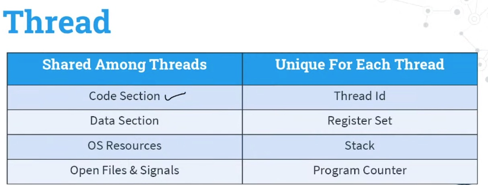
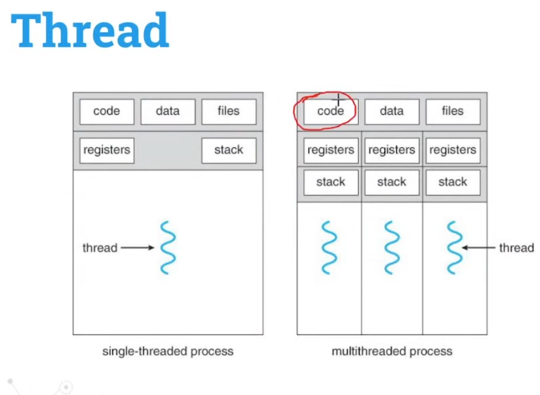
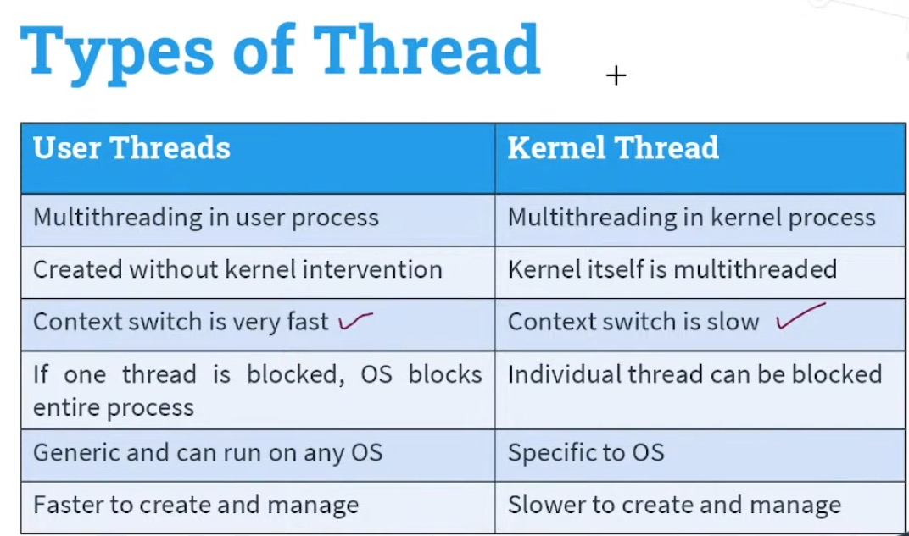
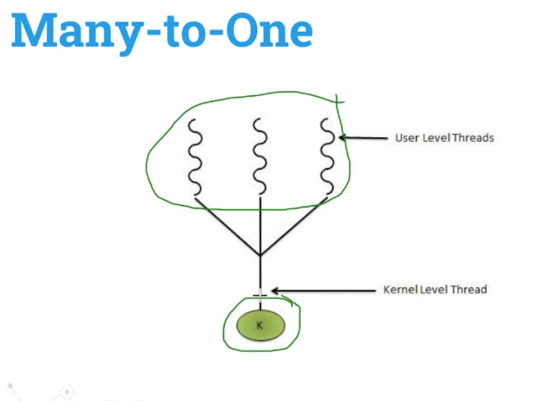
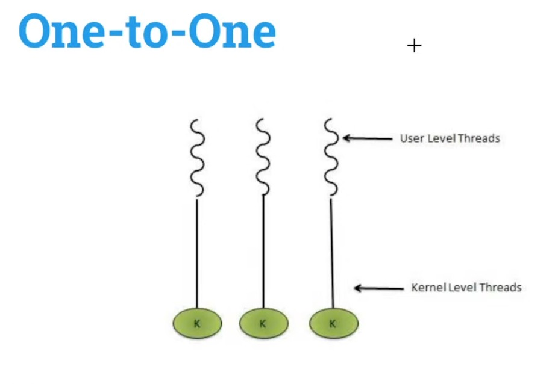
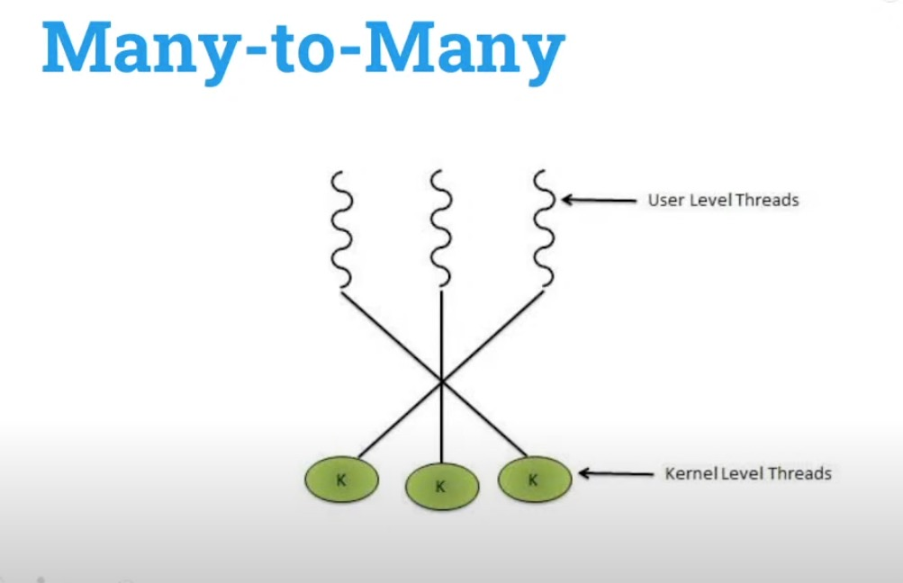

Thread

Thread is a Component of process
        or
Lightweight Process

Rather can creating multiple instances of Process create a multiple thread

Thread can share among

Code Section the instruction are share among all the threads
Data Section  global and static variable share among all the thread
Operating System Resources share among all the thread
Files  share among all the thread

Quique for each thread

Thread Id
Register Set
Stack         used for localvariable and function
Program Counter

  

  Advantages of Multithreading

    Responsiveness  - In Multithreading the responsiveness because threads are lightweight
    Faster Context Switching
    Resource Sharing
    Economy -- In webserver it helps to save lot of money
    Communication
    In Multiproccsseor -- In Multiple cpu  then multiple threads can also run parallell

Types of Threads

    User Level Threads
    Kernel Level Threads

In User level threads Process is managing the threads

In Simple words  when we create user level threads Operating System doesnot aware about  that threads for Operating System its just a Process

Kernel doesnot aware about user level threads

IN Kernel level thread context swtiching happens like a process.

Multithreading Model

1  Many To One   - Many User level threads  are Implementing/performed with One Kernel Level threads

2  One To One   -  One User Level threads are Implementing/performed with One Kernel Level threads

3 Many To Many   - Many User Level threads are Implementing/performed with Multiple Kernel Level threads

